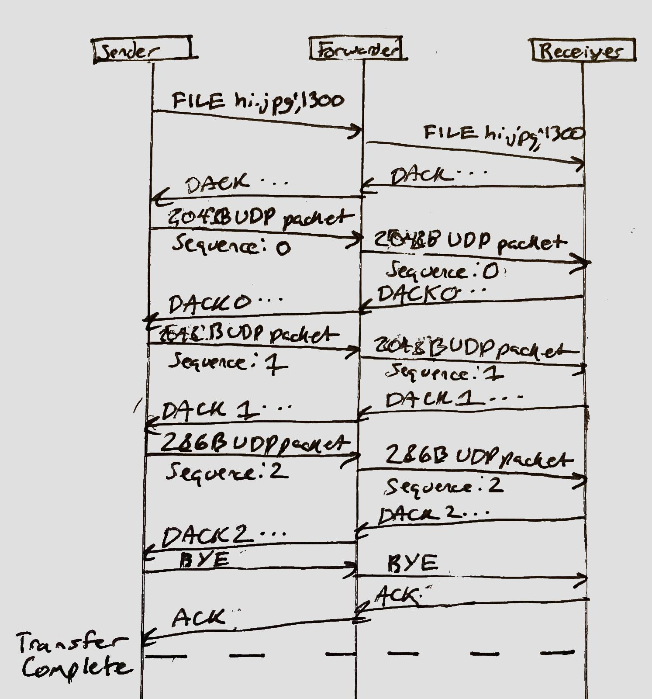

Ringo Design Document
========

| Author | Class | Date |
|:-------:|:-------:|:------:|
| Zachary Bloomquist | Networking I at Georgia Tech| 1 March 2018 |

Ringo is a protocol used for establishing ring networks and transmitting files upon the created ring network. It can automatically discover all peers in a given ring network and use heuristics to decide on an optimal path between them. Transfers on Ringo are also resistant to network delays and drop-outs. 

Ringo uses the UDP transport protocol to transfer data and implements timeouts and resending internally. All headers are ASCII text to simplify the Python implementation, the only binary packets sent are those containing the transmitted data.

## Timing Diagrams

### New Connection

The following timing diagram depicts what happens to an existing 3-Ringo ring when a new Ringo joins the network. As each server becomes aware of the new Ringo via incoming ping messages, each server pings it back and then broadcasts the new RTT vector. Once every server including the new Ringo has a complete RTT vector, every server must have the same ring configuration because the optimal ring algorithm is deterministic.


<div style="page-break-after: always; "></div>

### File Transfer


## Packet Structure

All packets except for data packets are transmitted as ASCII strings following this format:

`[Sequence Number]~[Command] [Arguments]\r\n`

The sequence number begins at 0 and rolls over once it reaches 2048. Each Ringo has an independent sequence.

### Hello Message

A client sends an initial message to a POC. Upon receiving this message, the POC will send the client a copy if its RTT Vector.

Example:  
`HELO`

### Keep-Alive

A Keep-Alive packet must be sent by every Ringo to every other Ringo directly every 15 seconds. This packet is just an ASCII string:

`PING`

In response, the pinged Ringo must send the pinging Ringo an ASCII string:

`PONG`

Measuring the round-trip time of this packet is used for RTT measurement for new hosts.

### RTT Vector

Whenever a Ringo has information abouts its RTT to a new server, it may rebroadcast that information, in addition to all of its other RTT information, to all known peers via an RTT vector announcement. This takes the form of a dictionary of IP address and port to RTT measurement pairs, formatted as follows:

`RTT <ip-address>:<port>:<rtt-measurement>`

The IP address is represented in dot-decimal notation and the RTT measurement is an integer quantity of milliseconds. This pair can be repeated multiple times separated by semicolons (`;`).

Example:  
`RTT 10.0.0.1:9001:100;10.0.0.2:9001:200`

This vector is also sent as a response to the Hello packet to inform new Ringos of the current known peer list.

### Data

A connection is established by sending a packet down the ring containing the filename and the number of bytes the file will be chunked into:

`FILE <filename> <byte-count>`

Upon receiving an ACK packet for this command, the sender will begin transmitting the data as 507-byte chunks with a 1-byte header containing the current sequence number, `0-255`. This sequence number is unsigned and may roll over. This means each UDP packet will be 508 bytes. The sender will transmit one packet at a time and wait for a corresponding `ACK` message from the receiver before sending the next packet.

A data packet may be retransmitted if the sender detects a timeout.

Once the data transfer is complete, the sender will terminate the connection by sending a single packet with the final sequence number:

`BYE`

This hangup will also be retransmitted if acknowledgement times out.

### ACK

Upon receiving a packet from the sender, the receiver must send an acknowledgment packet with the sequence number it has just received:

`ACK <sequence-number>`

## Algorithms

### Ring Formation

The optimal ring is updated immediately after the RTT matrix is updated. It is formed by first selecting the link between the 2 nodes with the lowest latency, and then selecting the next cheapest link that can be added with one endpoint already on the head or tail of the ring. It terminates once all known nodes are in the ring.

For example, with RTT matrix:

| | a | b | c | d |
|-|---|---|---|---|
|**a**| - | **2** | 12 | 9|
|**b**| 16 | - | 12 | 18 |
|**c**| 9 | 10 | - | 12 |
|**d**| 13 | 14 | 15 | - |

The ring would be formed iteratively as follows:

1. `-> a -> b ->`
2. `-> a -> b -> c ->`
3. `-> a -> b -> c -> d ->`

#### Pseudocode
```python
def optimal_ring(rtt_matrix):
    route = find_minimum_rtt(rtt_matrix)
    while (len(route) < len(rtt_matrix[0])):
        new_front = find_minimum_rtt(rtt_matrix, incident_to=route[0], not_in=route)
        new_back = find_minimum_rtt(rtt_matrix, incident_to=route[1], not_in=route)
        if (get_rtt(new_front) < get_rtt(new_back)):
            route.insert(0, new_front[1])
        else:
            route.append(new_back[1])
    return route
```

## Data Structures

### Ring

The optimal ring is stored as a 1-dimensional array of IP addresse and port pairs. It is understood to be circular.

### RTT Matrix

Every Ringo stores a local copy of a matrix containing the round trip times from all known Ringos to all known Ringos. The size of this matrix is `n^2` if `n` is the number of Ringos in the network. If an RTT is unknown, it is assumed to be infinite.

The list of all known Ringo IP and port pairss is stored as the list of keys of this matrix.

## Threads

Threads will be used to split up this project. The following threads will be used:

### Main

The main thread will spawn all other threads and also keep track of core data structures and the socket. It also is responsible for processing the initial command-line arguments and for sending the `HELO` connection message to the POC.

### Keep-Alive

This thread is responsible for sending and receiving `PING` and `PONG` messages. Additionally, it updates the RTT vector and broadcasts it when changes are made from Keep-Alive RTT measurements.

### RTT

This thread is responsible for receiving RTT updates and keeping the matrix and ring vector data structures up to date.

### CLI

This thread is responsible for handling user input and for chunking up and sending files. It is also responsible for receiving files.

<style type="text/css">
    h2 {
        page-break-before: always;
    }
    code {
        border: 1px solid #848484;
        border-radius: 2px;
        padding: 2px 5px;
    }
</style>